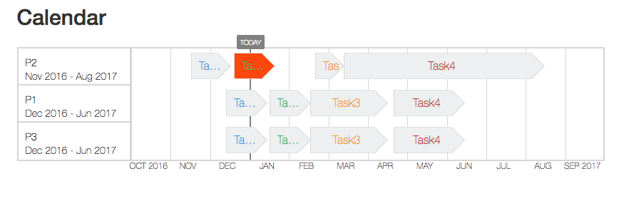

* The project was built using Angular 4
* The build system is loosely based on [AngularClass](https://github.com/AngularClass/angular-starter) 
* Developed and tested in Chrome v.58. Not all polyfills may have been installed, especially for IE.

To install and run:
* `npm install`
* `npm run start`

This is a small visualization of tasks within projects. Each project has several tasks, and the calendar shows multiple projects. The calendar spans 12 months: it starts 3 months before, and ends 9 months after today. Tasks are visually linked to calendar dates.

